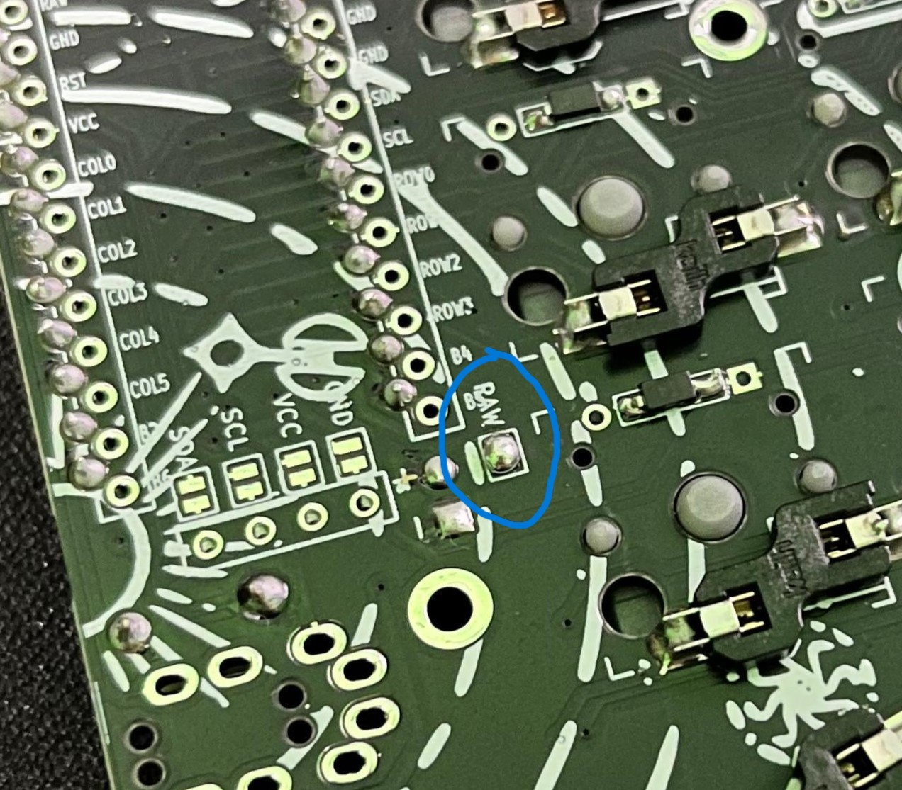

# Neko

A custom version of the [Chocofi keyboard](https://github.com/pashutk/chocofi). With slightly different edge cut and added custom silkscreen.

## List of changes

- Slight change from the original edge cut
- Remove the inner ( 3rd ) thumb key
- Add some graphic for the silkscreen

## Assembly

- Solder all the diode on the bottom side, make sure to solder it to the correct orientation like this
  
- Solder all the kailh hotswap socket on the bottom side
- ( Optional for **wireless** build )Solder power switch on the bottom side, after that, make sure to switch it off so that nothing happen when we solder the battery
  
- Solder the reset switch on the top side
- ( Optional for **wired** build) Solder the TRRS connector on the top side
- Solder the controller hotswap socket on the top side
- Solder the hotswap pin to the controller
- Remove the controller from the hotswap socket
- ( Optional for **wireless** build ) _Carefully_ solder battery wires to the connector, ensuring not to short the wires together, secure the other wire with masking tape, solder the black wire to the negative pad, and red wire to the positive pad
  
- ( Optional for **wireless** build ) Solder the battery Jumper ( labeled as RAW ) on the bottom side
  

If you using a wireless controller, you can use the [ZMK firmware](https://zmk.dev), and edit the keymap using the [Keymap editor](https://nickcoutsos.github.io/keymap-editor/) by Nickcoutsos. If you using a wired controller, you can use [QMK firmware](https://qmk.fm/), and edit the layout using [Via app](https://www.caniusevia.com/)
